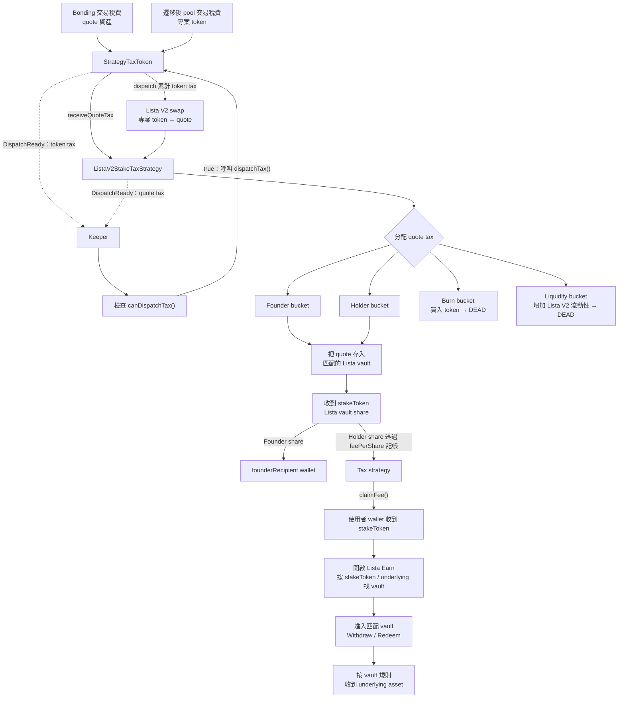

# Lista V2 質押稅費機制

[English](../../mechanisms/lista-v2-stake.md) | [繁體中文](./lista-v2-stake.md)

本文說明第三方前端、索引器、keeper 和資料分析後端應如何識別並接入 OpenFour Lista V2 質押稅費機制，重點包括 token 稅費生命週期、Lista V2 launch pair、Lista vault 質押，以及安全選擇交易路由所需的判斷訊號。

## 1. 元件與身份

該機制由 strategy-tax token、稅費 bonding 流程、Lista V2 migrate module 和每 token 專屬質押策略組成。

| 層級 | 合約或 tag | 用途 |
| --- | --- | --- |
| Token implementation | `StrategyTaxToken` / `token.strategy_tax` | 收取遷移後 token 稅費並委託分配 |
| Token module | `StrategyTaxTokenModule` / `module.token.strategy_tax` | Clone 並初始化 token 的已註冊策略 |
| Vault | `module.vault.tax_bonding` | 保管 bonding 資產，並通知 token 記錄 FeeRouter 已轉入的 quote 稅費 |
| Trade | `module.trade.tax_bonding` | 返回 bonding tax fee tiers |
| Migration | `BondingStrategyTaxListaV2MigrateModule` / `module.migrate.bonding_lista_v2` | 建立並注入 Lista V2 launch pair 流動性 |
| Tax strategy | `ListaV2StakeTaxStrategy` / `tax_strategy.lista_v2_stake` | 質押 quote bucket、兌換稅費、回購銷毀和增加流動性 |

`TokenCreated.encodedTags` 包含 token 和 module tag，但不包含 strategy tag。識別出 `token.strategy_tax` 後，應呼叫：

```solidity
StrategyTaxToken(token).strategyTag();
```

該機制預期返回 `tax_strategy.lista_v2_stake`。

## 2. 稅費、質押、領取與贖回完整流程



OpenFour 負責收取稅費、存入 Lista、share accounting 及 share claim。贖回則是使用者與 Lista vault 之間的另一筆獨立互動。

## 3. 遷移與 Pair 解碼

Bonding vault 售罄後可以遷移。Migrate module 會：

1. 驗證 factory 目前的 `getPair(token, quoteAsset)` 等於 `launchPair`。
2. 從 `totalRaised` 扣除 2% migrate fee：1% protocol fee 發送至 treasury，1% creator fee 發送至建立者（建立者為零地址時回退至 treasury）。
3. 將剩餘 quote 和未售 token 注入 Lista V2 流動性。
4. 將 LP token 發送至 dead address。
5. 如果累計了 anti-sniper quote，執行 buyback/burn。
6. 呼叫 token migration hook，並 dispatch 待處理 strategy tax。

對 `module.migrate.bonding_lista_v2`：

```text
migratedDataVersion = 1
encodedMigratedData = abi.encode(address pair)
```

索引器僅應在以下條件全部成立時，將解碼出的 pair 視為已啟用：

- `vault.phase() == Migrated`。
- `MigrateExecuted.migrateTagId == bytes8(keccak256(bytes("module.migrate.bonding_lista_v2")))`。
- `migratedDataVersion == 1`。
- 解碼地址等於已配置 factory 的 `getPair(token, quoteAsset)`。

## 4. 稅費收取

### 4.1 Bonding 階段

`Trading` 階段的稅費以 quote asset 計價。FeeRouter 先把 quote 稅費直接轉給 `StrategyTaxToken`，vault 再呼叫 `onBondingTrade()` 作為記帳通知；`StrategyTaxToken` 隨後把已收到的 quote 稅費轉入 strategy，並透過 `receiveQuoteTax()` 記帳。

待處理 quote tax 跨過 `minDispatchQuote` 時，strategy 發出：

```solidity
DispatchReady(1, pendingQuoteAmount);
```

### 4.2 Migrated 階段

遷移後，`StrategyTaxToken` 按以下條件分類 pool 轉帳：

```text
buy  = migratedPools[from] && to != vault
sell = migratedPools[to]   && from != vault
```

系統按方向選擇 `buyFeeRate` 或 `sellFeeRate`，以 token 單位扣除並累計到 `tokenAccumulated`。跨過 token threshold 時發出：

```solidity
DispatchReady(0, pendingTokenAmount);
```

Token dispatch guard 啟用期間產生的轉帳不會遞迴收稅，因此 strategy swap 和增加流動性時不會重複向自身收稅。

## 5. Dispatch 與分配

任何人都可以呼叫 `StrategyTaxToken.dispatchTax()`。`DispatchReady` 只是 keeper hint，送出交易前應先檢查 `canDispatchTax()`。

Strategy 按以下順序處理：

1. Flush 之前延後的 founder 和 holder 工作。
2. 遷移後，當 token threshold 被超過時，將累計 tax token 換成 quote。
3. Quote tax 達到 `minDispatchQuote` 後，按有效的 founder、holder、burn、liquidity bucket 分配。
4. 遷移後重試延後的 burn/liquidity 工作。

外部操作失敗不會丟失 accounting；strategy 會記錄 deferred amount，並發出 `FeeDispatchDeferred`。

## 6. Lista 質押與 Holder Accounting

### 6.1 質押內容與使用者領取資產

Founder 和 holder 的 quote bucket 會存入依 token quote asset 選擇的 Lista vault：

- Wrapped native quote 透過 native deposit 路徑進入已配置的 Lista collateral-yield vault。
- 受支援 stable quote 使用已配置的 ERC-4626 vault，且其 `asset()` 必須等於 quote token。

收到的 vault share token 即 `stakeToken`：

- Founder share 直接轉給 `founderRecipient`。
- Holder share 透過 `feePerShare` 按比例分配。
- `quotePerShare` 記錄歸屬於 holder 的底層 quote 金額。

目前實現中，`stakeToken` 是所選 Lista vault 的 share-token 合約，地址與 `listaVault` 相同。

`StrategyTaxToken` 會在轉帳後同步 holder 資格。零地址、token 本身、dead address、vault、tax strategy、黑名單地址、已註冊 pool，以及低於 `minShare` 的餘額均不納入分配。

使用者可透過以下介面讀取並領取：

```solidity
taxStrategy.feeAssets();                 // [stakeToken]
taxStrategy.claimableFee(account);
taxStrategy.claimFee();
taxStrategy.claimFee(accounts);          // keeper-friendly batch
```

Claim 發送的是 Lista vault share，而不是原始 quote。

這些 token 與 strategy 專屬呼叫應使用打包的 `scripts/abi/StrategyTaxToken.json` 和 `scripts/abi/ListaV2StakeTaxStrategy.json`。通用 `ITaxStrategy` ABI 只涵蓋共同 strategy 介面，不包含具體 claim 方法。

### 6.2 透過 Lista 贖回 stakeToken

`claimFee()` 成功後：

1. 讀取 `taxStrategy.feeAssets()[0]` 或 `taxStrategy.stakeToken()`，核對 wallet 收到的 share-token 地址。
2. 在正確網路開啟 [Lista Earn](https://lista.org/lending/earn)。
3. 尋找 vault/share-token 地址及 underlying asset 同時符合 `stakeToken` 和 strategy quote 配置的 pool，不要只依賴顯示名稱判斷。
4. 進入該 vault，選擇 withdraw/redeem 操作。
5. 選擇要贖回的 `stakeToken` share 數量，並確認 Lista 交易。
6. Vault 銷毀或收取 share，按當前 exchange rate 和提款規則返回 underlying asset。

對受支援 stable quote，所選 ERC-4626 vault 的 `asset()` 等於 quote token。對 wrapped native，strategy 透過 Lista native collateral-yield 路徑存入；使用者最終收到的資產以 Lista vault 當前顯示的提款選項為準。

Underlying 數量不一定等於 share 數量。收益、share price、可用流動性、費用、限額、cooldown 和提款可用性均由 Lista vault 控制，確認前應讀取即時 Lista UI/合約。OpenFour 不會代使用者贖回 `stakeToken`。

## 7. Lista V2 Swap、Burn 與 Liquidity

Strategy swap 要求存在直接的 Lista V2 `taxToken/quote` pair，並使用支援 fee-on-transfer 的 exact-input router 介面；實際輸出按 recipient balance delta 計算。

遷移後：

- Burn bucket：quote 換成專案 token，並發送至 dead address。
- Liquidity bucket：一半 quote 換成專案 token，再將兩種資產加入 Lista V2，LP token 發送至 dead address。

前端的 tax-token zap 路由同樣應使用 V2 相容 exact-input 介面。Exact-output 不適用，因為 transfer tax 會改變 recipient 的實際餘額增量。

## 8. 接入檢查清單

- 不要用 `token.tax` 識別該機制；它的 token tag 是 `token.strategy_tax`。
- 不要在 `encodedTags` 中尋找 `tax_strategy.lista_v2_stake`；應呼叫 `strategyTag()`。
- 不要把 `migratedPools(pair)` 當作 pool 已啟用狀態。
- 切換外盤前，同時校驗 phase、migrate tag、data version 和 factory pair。
- 使用支援 fee-on-transfer 的 exact-input swap 和 balance-delta accounting。
- 將 `DispatchReady` 視為提示，並檢查 `canDispatchTax()`。
- Holder reward 應以 `stakeToken` 單位展示，並透過 `feeAssets()` 取得 stake-token 地址。
