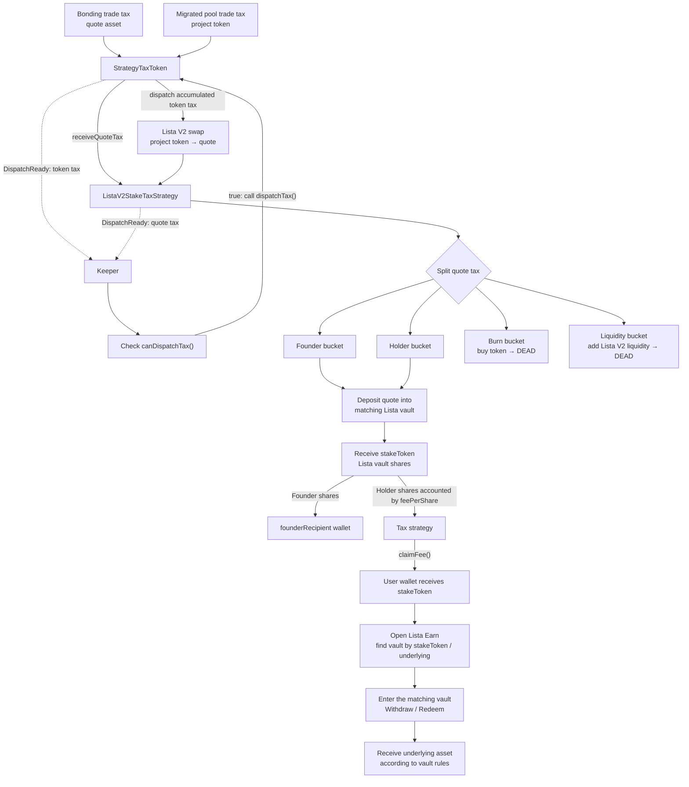

# Lista V2 Stake-Tax Mechanism

[English](./lista-v2-stake.md) | [繁體中文](../docs/zh-Hant/mechanisms/lista-v2-stake.md)

This document explains how third-party frontends, indexers, keepers, and analytics backends should identify and integrate the OpenFour Lista V2 stake-tax mechanism. It focuses on the token tax lifecycle, Lista V2 launch pair, Lista vault staking, and the signals required to select a safe trading route.

## 1. Components and Identity

The mechanism combines a strategy-tax token, a tax-aware bonding flow, a Lista V2 migration module, and a per-token staking strategy.

| Layer | Contract or tag | Purpose |
| --- | --- | --- |
| Token implementation | `StrategyTaxToken` / `token.strategy_tax` | Collects post-migration token tax and delegates distribution |
| Token module | `StrategyTaxTokenModule` / `module.token.strategy_tax` | Clones and initializes the token's registered strategy |
| Vault | `module.vault.tax_bonding` | Holds bonding assets and notifies the token to account for quote tax transferred by FeeRouter |
| Trade | `module.trade.tax_bonding` | Returns bonding tax fee tiers |
| Migration | `BondingStrategyTaxListaV2MigrateModule` / `module.migrate.bonding_lista_v2` | Creates and seeds the Lista V2 launch pair |
| Tax strategy | `ListaV2StakeTaxStrategy` / `tax_strategy.lista_v2_stake` | Stakes quote buckets, swaps tax, burns, and adds liquidity |

`TokenCreated.encodedTags` contains the token and module tags, but not the strategy tag. After detecting `token.strategy_tax`, call:

```solidity
StrategyTaxToken(token).strategyTag();
```

The expected strategy tag for this mechanism is `tax_strategy.lista_v2_stake`.

## 2. End-to-End Tax, Stake, Claim, and Redemption Flow



OpenFour performs the tax collection, Lista deposit, share accounting, and share claim. Redemption is a separate interaction between the user and the Lista vault.

## 3. Migration and Pair Decoding

Migration is available after the bonding vault is sold out. The migration module:

1. Verifies the factory's current `getPair(token, quoteAsset)` equals `launchPair`.
2. Deducts a 2% migration fee from `totalRaised`: 1% protocol fee to treasury and 1% creator fee (falling back to treasury when the creator is zero).
3. Adds the remaining quote and unsold token supply as Lista V2 liquidity.
4. Sends LP tokens to the dead address.
5. Runs the anti-sniper buyback/burn path when accrued quote is present.
6. Calls the token migration hook and dispatches pending strategy tax.

For `module.migrate.bonding_lista_v2`:

```text
migratedDataVersion = 1
encodedMigratedData = abi.encode(address pair)
```

An indexer should accept the decoded pair as active only when:

- `vault.phase() == Migrated`.
- `MigrateExecuted.migrateTagId == bytes8(keccak256(bytes("module.migrate.bonding_lista_v2")))`.
- `migratedDataVersion == 1`.
- The decoded address equals the configured factory's `getPair(token, quoteAsset)`.

## 4. Tax Collection

### 4.1 Bonding Phase

During `Trading`, tax is denominated in the quote asset. FeeRouter transfers the quote tax directly to `StrategyTaxToken`; the vault then calls `onBondingTrade()` as an accounting notification. `StrategyTaxToken` transfers the received quote tax to the strategy and records it through `receiveQuoteTax()`.

When pending quote tax crosses `minDispatchQuote`, the strategy emits:

```solidity
DispatchReady(1, pendingQuoteAmount);
```

### 4.2 Migrated Phase

After migration, `StrategyTaxToken` classifies pool transfers as:

```text
buy  = migratedPools[from] && to != vault
sell = migratedPools[to]   && from != vault
```

The selected `buyFeeRate` or `sellFeeRate` is deducted in token units and accumulated in `tokenAccumulated`. Crossing the token threshold emits:

```solidity
DispatchReady(0, pendingTokenAmount);
```

Transfers performed while the token's dispatch guard is active are exempt from recursive taxation. This allows strategy swaps and liquidity additions to complete without charging themselves repeatedly.

## 5. Dispatch and Distribution

Anyone may call `StrategyTaxToken.dispatchTax()`. `DispatchReady` is only a keeper hint; call `canDispatchTax()` before submitting.

The strategy processes tax in this order:

1. Flush previously deferred founder and holder work.
2. After migration, swap accumulated tax tokens to quote when the token threshold is exceeded.
3. Once quote tax reaches `minDispatchQuote`, split it across active founder, holder, burn, and liquidity buckets.
4. Retry deferred burn/liquidity work after migration.

Failed external actions do not discard accounting. The strategy records deferred amounts and emits `FeeDispatchDeferred`.

## 6. Lista Staking and Holder Accounting

### 6.1 What Is Staked and What the User Claims

Founder and holder quote buckets are deposited into the Lista vault selected for the token's quote asset:

- Wrapped native quote uses the configured Lista collateral-yield vault through its native deposit path.
- Supported stable quotes use the configured ERC-4626 vault whose `asset()` must equal the quote token.

The received vault share token is `stakeToken`:

- Founder shares are transferred directly to `founderRecipient`.
- Holder shares are distributed pro rata using `feePerShare`.
- `quotePerShare` records the underlying quote amount attributed to holders.

In the current implementation, `stakeToken` is the selected Lista vault's share-token contract and has the same address as `listaVault`.

Holder eligibility is synchronized by `StrategyTaxToken` after transfers. Zero address, the token itself, dead address, vault, tax strategy, blacklisted accounts, registered pools, and balances below `minShare` are excluded.

Users can read and claim with:

```solidity
taxStrategy.feeAssets();                 // [stakeToken]
taxStrategy.claimableFee(account);
taxStrategy.claimFee();
taxStrategy.claimFee(accounts);          // keeper-friendly batch
```

Claims transfer Lista vault shares, not raw quote.

Use the bundled `scripts/abi/StrategyTaxToken.json` and `scripts/abi/ListaV2StakeTaxStrategy.json` for these token- and strategy-specific calls. The generic `ITaxStrategy` ABI only covers the common strategy interface and does not include concrete claim methods.

### 6.2 Redeeming stakeToken Through Lista

After `claimFee()` succeeds:

1. Read `taxStrategy.feeAssets()[0]` or `taxStrategy.stakeToken()` and verify the share-token address received by the wallet.
2. Open [Lista Earn](https://lista.org/lending/earn) on the correct network.
3. Find the pool whose vault/share-token address and underlying asset match `stakeToken` and the strategy's quote configuration. Do not identify a vault by display name alone.
4. Enter that vault and choose its withdraw/redeem action.
5. Select the amount of `stakeToken` shares to redeem and confirm the Lista transaction.
6. The vault burns or consumes the shares and returns the underlying asset according to its current exchange rate and withdrawal rules.

For a supported stable quote, the selected ERC-4626 vault's `asset()` equals the quote token. For wrapped native, the strategy deposits through Lista's native collateral-yield path; the asset returned to the user follows that vault's withdrawal options shown by Lista.

The number of underlying units is not necessarily equal to the number of shares. Yield, share price, available liquidity, fees, limits, cooldowns, and withdrawal availability are controlled by the Lista vault and should be read from the live Lista UI/contract before confirmation. OpenFour does not redeem `stakeToken` on the user's behalf.

## 7. Lista V2 Swaps, Burn, and Liquidity

Strategy swaps require the direct Lista V2 `taxToken/quote` pair and use the fee-on-transfer-compatible exact-input router method. Actual output is measured by recipient balance delta.

After migration:

- Burn bucket: quote is swapped for the project token and sent to the dead address.
- Liquidity bucket: half of quote is swapped for the project token; both assets are added to Lista V2, and LP tokens are sent to the dead address.

Frontend tax-token zap routes should also use exact-input V2-compatible methods. Exact-output routes are unsuitable because transfer tax changes the recipient's actual balance increase.

## 8. Integration Checklist

- Do not identify this mechanism from `token.tax`; its token tag is `token.strategy_tax`.
- Do not expect `tax_strategy.lista_v2_stake` inside `encodedTags`; call `strategyTag()`.
- Do not treat `migratedPools(pair)` as pool-live state.
- Require phase, migrate tag, data version, and factory pair verification before external routing.
- Use fee-on-transfer-compatible exact-input swaps and balance-delta accounting.
- Treat `DispatchReady` as a hint and verify `canDispatchTax()`.
- Display holder rewards in `stakeToken` units and expose the stake-token address from `feeAssets()`.
